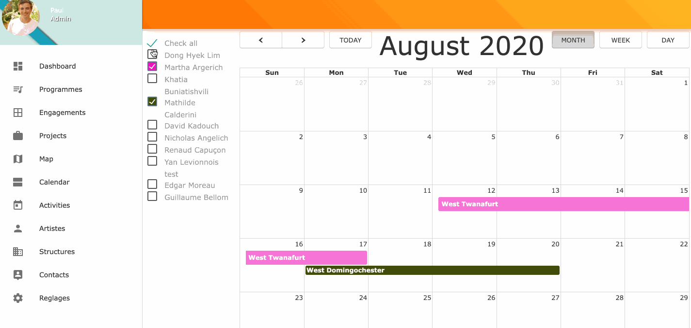
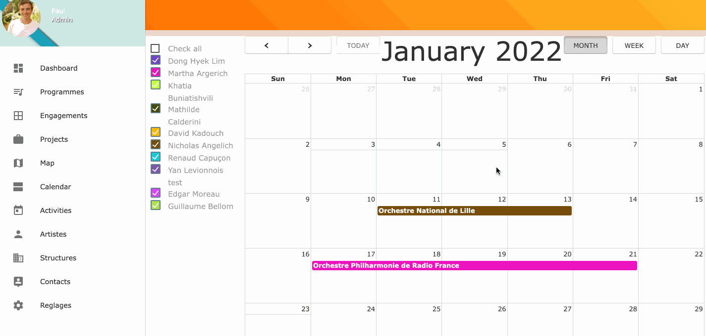
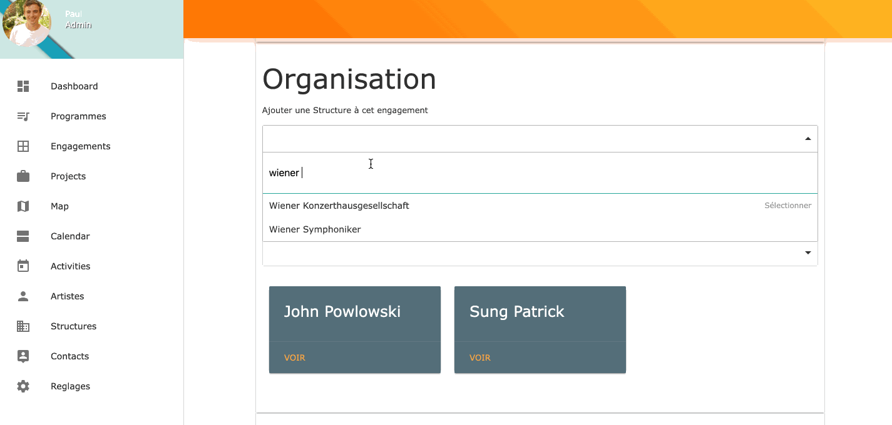

# Scherzo App

This app is a personal project for learning Ruby on Rails.

It uses Fullcalendar with dynamic views:

It allows the creation of events directly in the calendar thanks to StimulusJS

